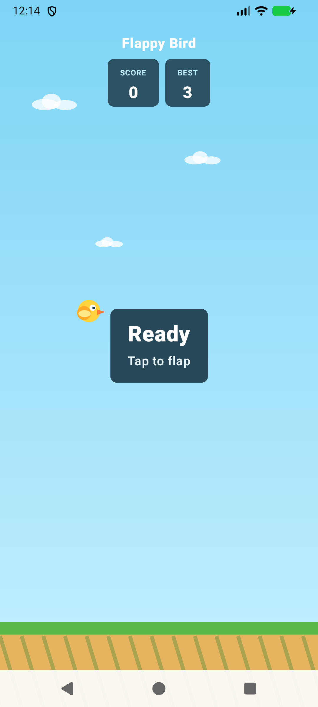
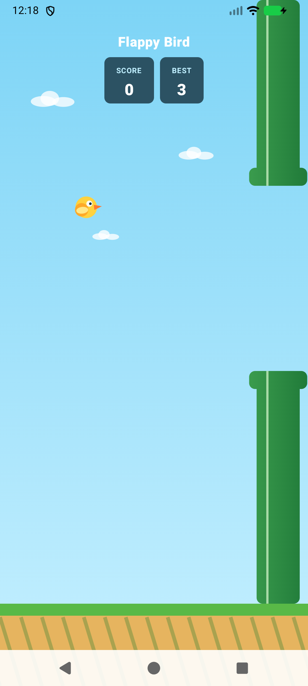
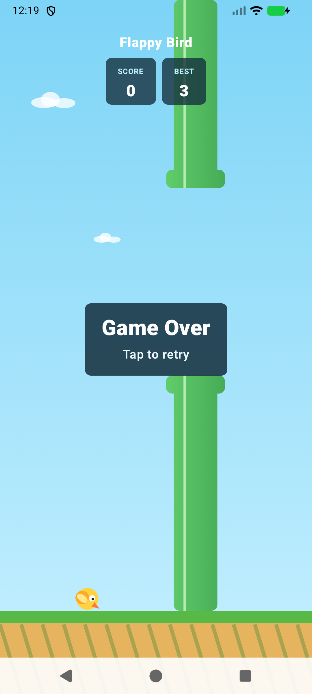

# Flappy Bird Clone

A native Android arcade game built with Kotlin and Jetpack Compose. The game uses a custom Compose `Canvas` for all visuals, a frame-driven physics loop, procedural pipe generation, collision detection, scoring, and tap-to-retry gameplay.

This project does not depend on external sprite assets. The bird, pipes, clouds, sky, and ground are drawn directly with Compose graphics primitives.

## Screenshots

<table>
  <tr>
    <th>Ready</th>
    <th>Playing</th>
    <th>Game Over</th>
  </tr>
  <tr>
    <td></td>
    <td></td>
    <td></td>
  </tr>
</table>

## Features

- One-tap flap controls.
- `Ready`, `Playing`, and `Game Over` states.
- Gravity and flap velocity physics updated every frame.
- Continuously scrolling and replenished pipe obstacles.
- Deterministic pipe-gap placement.
- Circle-to-rectangle pipe collision detection.
- Ground and ceiling collision detection.
- Score tracking when the bird passes a pipe.
- Persistent high score that survives retries and app restarts.
- Tap-to-retry flow after a collision.
- Edge-to-edge Android UI.
- Responsive Canvas coordinates based on screen size.
- Procedurally drawn game art with no external sprite licensing requirements.
- JVM unit tests for core game behavior.
- Compose instrumentation test for the initial screen and accessibility semantics.

## Controls

| State | Action |
| --- | --- |
| Ready | Tap anywhere to start and flap. |
| Playing | Tap anywhere to flap upward. |
| Game Over | Tap anywhere to reset and immediately start again. |

## Technology

- Kotlin 2.3.20
- Jetpack Compose with Compose BOM 2026.03.01
- Compose Canvas and `DrawScope`
- Material 3
- Navigation 3
- Android Gradle Plugin 9.0.1
- Gradle 9.1.0
- Android `SharedPreferences` for high-score persistence
- Java toolchain 21 with Java 17 Android source compatibility
- JUnit 4 and Compose UI Test

## Architecture

The game is split into a rendering layer and a platform-independent game engine.

### Game engine

[`GameEngine.kt`](app/src/main/java/com/example/flappybirdclone/ui/main/GameEngine.kt) contains immutable game state and gameplay rules:

- `GameWorld` stores the bird, pipes, score, and current phase.
- `onTap()` handles start, flap, and retry transitions.
- `tick()` applies gravity, moves pipes, replenishes obstacles, awards points, and checks collisions.
- Normalized coordinates keep physics independent from Android display density and screen resolution.

Because this layer does not depend on Compose or Android APIs, its behavior can be tested with ordinary JVM tests.

### High score persistence

[`HighScoreStore.kt`](app/src/main/java/com/example/flappybirdclone/ui/main/HighScoreStore.kt) keeps best-score persistence separate from the game engine:

- `HighScoreStore` defines the read/write contract.
- `SharedPreferencesHighScoreStore` stores the best score across app launches.
- `HighScoreTracker` accepts only scores that exceed the current best.
- The Compose screen observes score changes and updates the `BEST` badge immediately.

### Rendering and input

[`MainScreen.kt`](app/src/main/java/com/example/flappybirdclone/ui/main/MainScreen.kt) owns the Compose game surface:

- `withFrameNanos` drives frame updates.
- `Canvas` renders the environment, obstacles, and bird.
- `detectTapGestures` forwards touch input to the game engine.
- Material 3 composables render the title, score, ready prompt, and game-over prompt.
- Safe-drawing insets keep the HUD clear of system bars.

## Project Structure

```text
FlappyBirdClone/
|-- app/
|   |-- src/main/java/com/example/flappybirdclone/
|   |   |-- MainActivity.kt
|   |   |-- Navigation.kt
|   |   |-- NavigationKeys.kt
|   |   |-- theme/
|   |   `-- ui/main/
|   |       |-- GameEngine.kt
|   |       |-- HighScoreStore.kt
|   |       `-- MainScreen.kt
|   |-- src/test/.../
|   |   |-- GameEngineTest.kt
|   |   `-- HighScoreTrackerTest.kt
|   `-- src/androidTest/.../MainScreenTest.kt
|-- captures/
|   |-- flappy-ready.png
|   |-- flappy-playing.png
|   `-- flappy-gameplay.png
|-- DEVELOPMENT_PLAN.md
|-- gradle/
`-- README.md
```

## Requirements

- Android Studio with JDK 21, or another installed JDK 21 distribution.
- Android SDK Platform 36.
- Android device or emulator running API 24 or newer.

The application configuration is:

| Setting | Value |
| --- | --- |
| Application ID | `com.example.flappybirdclone` |
| Minimum SDK | 24 |
| Target SDK | 36 |
| Compile SDK | 36 |

## Getting Started

1. Clone the repository:

   ```bash
   git clone git@github.com:himu-gupta/FlappyBirdClone.git
   cd FlappyBirdClone
   ```

2. Open the project in Android Studio.

3. Allow Gradle sync to complete and select an API 24+ emulator or connected device.

4. Run the `app` configuration.

## Command-Line Build

On macOS with Android Studio's bundled JDK:

```bash
JAVA_HOME="/Applications/Android Studio.app/Contents/jbr/Contents/Home" \
  ./gradlew :app:assembleDebug
```

The generated APK is written to:

```text
app/build/outputs/apk/debug/app-debug.apk
```

## Testing

Run the JVM game-engine tests:

```bash
JAVA_HOME="/Applications/Android Studio.app/Contents/jbr/Contents/Home" \
  ./gradlew :app:testDebugUnitTest
```

Run the Compose instrumentation test with an emulator or device connected:

```bash
JAVA_HOME="/Applications/Android Studio.app/Contents/jbr/Contents/Home" \
  ./gradlew :app:connectedDebugAndroidTest
```

Build and run the local unit tests together:

```bash
JAVA_HOME="/Applications/Android Studio.app/Contents/jbr/Contents/Home" \
  ./gradlew :app:assembleDebug :app:testDebugUnitTest
```

The unit tests cover starting the game, pipe movement, one-time score increments, loading a saved best score, persisting a new best, and rejecting lower replacement scores. The instrumentation test verifies the initial ready state, score HUD, loaded best score, and game field accessibility description.

## Gameplay Tuning

Core gameplay values are defined near the top of `GameEngine.kt`:

- Gravity
- Flap velocity
- Pipe speed
- Pipe width and spacing
- Pipe gap size
- Bird size and starting position
- Ground height

Keeping these values together makes difficulty changes straightforward without modifying rendering code.

## Planned Improvements

- Persist a high score with DataStore.
- Add flap, score, and collision sound effects.
- Add a progressive difficulty curve.
- Add pause and resume handling.
- Add a custom launcher icon.
- Expand collision and long-running simulation tests.
- Add automated screenshot tests for multiple device sizes.

## Development Notes

The original implementation plan is available in [`DEVELOPMENT_PLAN.md`](DEVELOPMENT_PLAN.md). Emulator captures are stored under [`captures/`](captures/) and are committed so they render directly on GitHub.

## Disclaimer

This is an independent educational clone created to demonstrate Android game rendering and state management with Jetpack Compose. It is not affiliated with or endorsed by the original Flappy Bird creator or rights holders.
